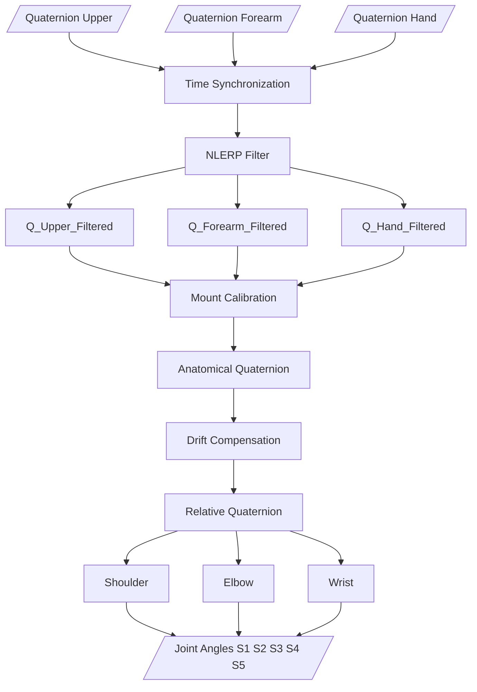
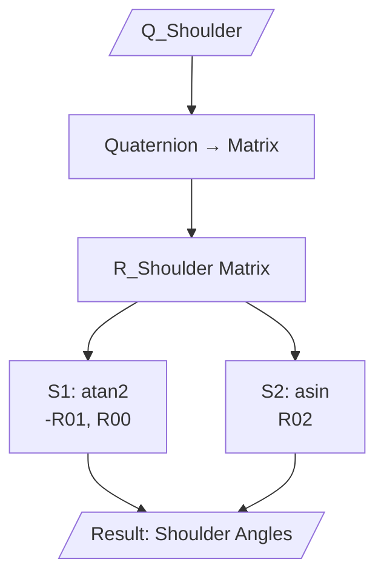
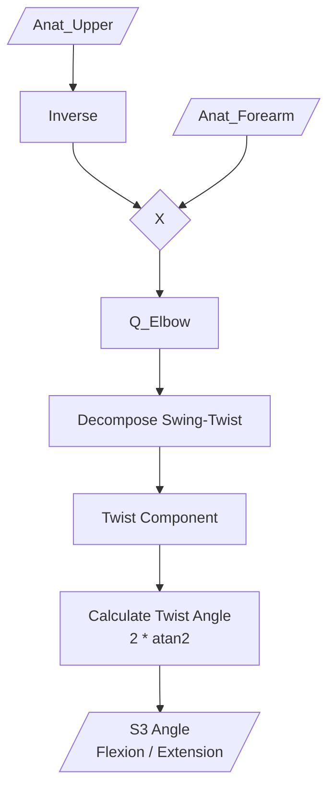
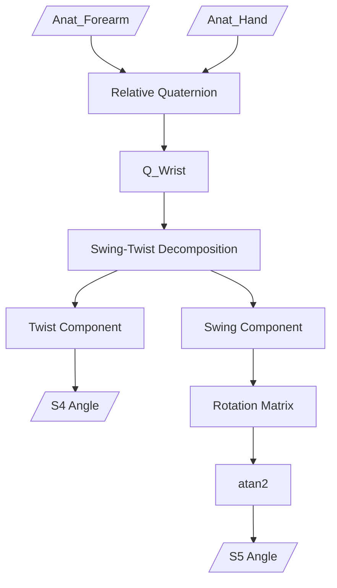

# Robotic Arm Control via Sensor Glove

# Table of Content
1. Introduction
2. Features
3. Hardware
4. Software
5. Getting Started
6. Results
7. Future Work
8. Contact
9. License

# 1. Introduction
This project focuses on the design and fabrication of a 5-degree-of-freedom (5 DOF) robotic arm equipped with a gripper, capable of imitating human arm movements in real-time. Tilt angles and motion data are acquired via a sensor glove equipped with the ICM20948 IMU module.

The project is developed with the aim of researching robotic applications in hazardous environments, enabling remote pick-and-place operations without direct physical intervention.

# 2. Features
🎯 Real-time Control: Low latency operation, accurately tracking and imitating human hand movements.

🧭 Digital Processing with DMP: Utilizes the ICM20948's onboard Digital Motion Processor to calculate Quaternions directly on the sensor, significantly reducing the processing load on the main microcontroller.

⚡ Power Optimization: Features a customized voltage divider circuit and optimized current consumption for better efficiency.

🛠️ Fully Open-source: Provides complete source code, PCB design files, and 3D printing models.

# 3. Hardware

## 3.1 Bill of Materials - BOM
Here is the list of main components used in this project.

| Component  | Qty | 
| :--- | ---: | 
| ESP32 | 2 | 
| ICM20948 | 3 | 
| Servo MG996R | 3 | 
| Servo MG90S | 3 |
| PCA9685 | 1 |
| Flex Sensor | 1 |
| Resistor 4.7k | 2 |
| Resistor 10k | 1 |
| Resistor 100k | 1 |
| Resistor 200k | 1 |
| LED | 1 |
| Toggle Switch | 1 |
| Lipo 2s 420mAh | 1 |
| Mini360 | 1 |
| Ball Bearing 6806ZZ (30x42x7) | 1 |

📌 Note: For the mechanical structure, all .STL files required for 3D printing the robotic arm are provided in the /3D_Models directory.

## 3.2 Wiring & PCB
The schematic and PCB layout files, designed using EasyEDA.com, are located in the /Hardware folder. Due to the I2C address conflict among the ICM20948 sensors (which have a default address of 0x68), we need to connect the AD0 pin of each sensor to Vcc or GND to fix their addresses to either 0x68 or 0x69, as illustrated below.

Below is the wiring diagram of the sensor glove circuit.

A voltage divider circuit is implemented for the flex sensor to read the ADC value on pin D34 of the ESP32. When the flex sensor bends, its resistance changes, which in turn alters the voltage at the junction between the flex sensor and the 10k resistor.

Image of the sensor glove's PCB layout:

## 3.3 3D Printing
Recommended print settings:

Material: PLA / PETG

Infill: > 30%

Layer height: 0.2mm

# 4. Software

## 4.1 Overall System Flowchart

📊 System Flowchart

## 4.2 Flowchart PCA Calibration
This is the most unique core algorithm of the project for coordinate axis calibration.

```mermaid
graph TD
  START([START PCA]) --> NPOSE[N-Pose Posture]
  NPOSE --> GRAV[Measure Gravity Vectors<br>gUpper, gForearm, gHand]
  GRAV --> PCA_S[Shoulder PCA <br> Shoulder Motion]
  PCA_S --> THU_S[Collect Quaternions for 3s]
  THU_S --> DELTA_S[Calculate ΔQuaternion]
  DELTA_S --> COV_S[Create Covariance Matrix]
  COV_S --> POW_S[Power Iteration]
  POW_S --> AXIS_S[Shoulder PCA Axis]
  
  AXIS_S --> PCA_E[Elbow PCA <br> Elbow Motion]
  PCA_E --> THU_E[Collect Quaternions for 3s]
  THU_E --> DELTA_E[Calculate ΔQuaternion]
  DELTA_E --> COV_E[Create Covariance Matrix]
  COV_E --> POW_E[Power Iteration]
  POW_E --> AXIS_E[Elbow PCA Axis]
  
  AXIS_E --> PCA_W[Wrist PCA <br> Wrist Motion]
  PCA_W --> THU_W[Collect Quaternions for 3s]
  THU_W --> DELTA_W[Calculate ΔQuaternion]
  DELTA_W --> COV_W[Create Covariance Matrix]
  COV_W --> POW_W[Power Iteration]
  POW_W --> AXIS_W[Wrist PCA Axis]
  
  AXIS_W --> GRAM[Gram-Schmidt Orthogonalization]
  GRAM --> MOUNT[Create Mount Quaternion]
  MOUNT --> SAVE[Save Q_Mount]
  SAVE --> END([END])
```

📊 PCA Calibration 

## 4.3 Quaternion Processing Pipeline
This is the main continuous data processing pipeline in the system loop.

📊 PCA Calibration 

## 4.4 Shoulder Angles

  

## 4.5 Elbow Angle

## 4.6 Wrist Angles

  

# 5. Getting Started
