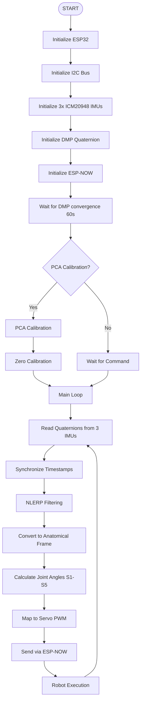
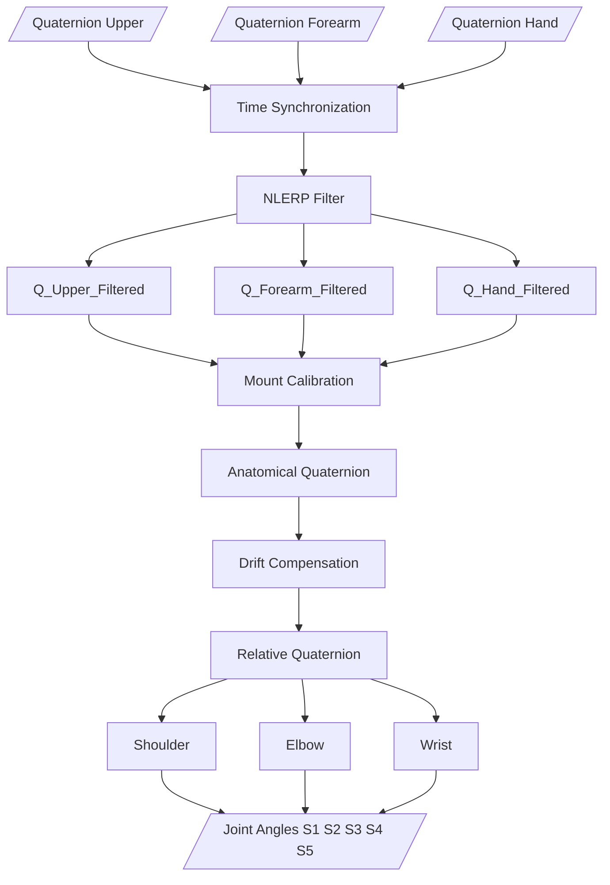
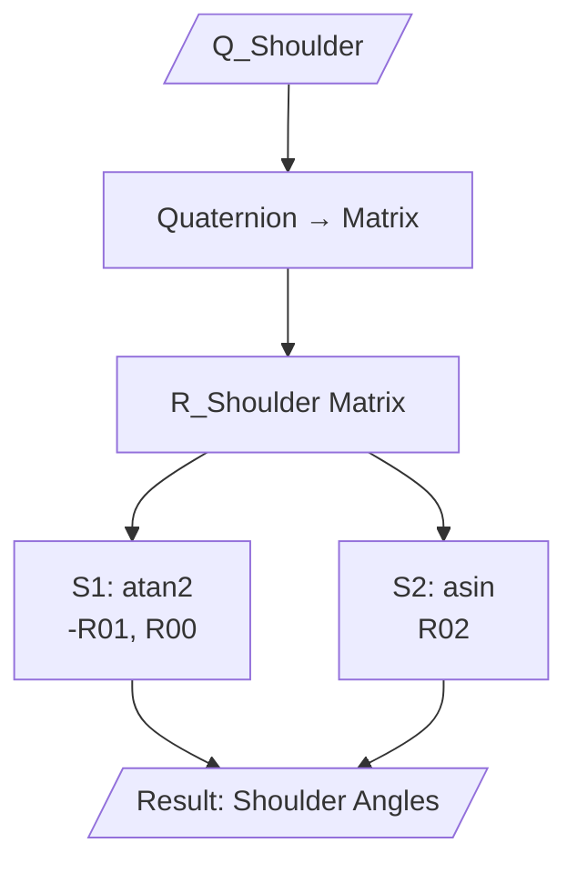
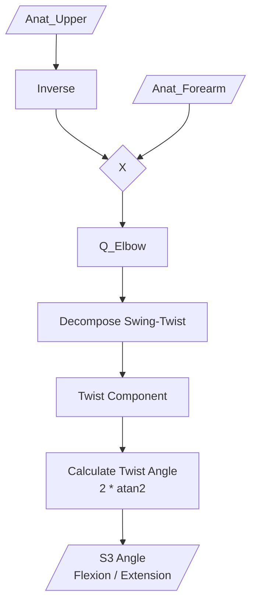
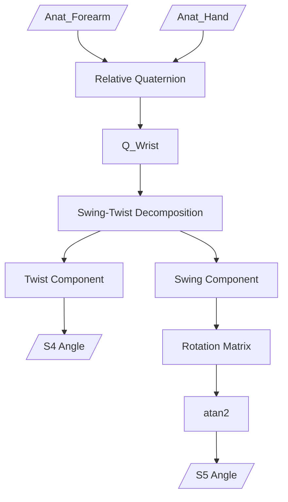

# Robotic Arm Control via Sensor Glove

# Table of Content
1. Introduction
2. Features
3. Hardware
4. Software
5. Getting Started
6. Results
7. Future Work
8. Contact
9. License

# 1. Introduction
This project focuses on the design and fabrication of a 5-degree-of-freedom (5 DOF) robotic arm equipped with a gripper, capable of imitating human arm movements in real-time. Tilt angles and motion data are acquired via a sensor glove equipped with the ICM20948 IMU module.

The project is developed with the aim of researching robotic applications in hazardous environments, enabling remote pick-and-place operations without direct physical intervention.

# 2. Features
🎯 Real-time Control: Low latency operation, accurately tracking and imitating human hand movements.

🧭 Digital Processing with DMP: Utilizes the ICM20948's onboard Digital Motion Processor to calculate Quaternions directly on the sensor, significantly reducing the processing load on the main microcontroller.

⚡ Power Optimization: Features a customized voltage divider circuit and optimized current consumption for better efficiency.

🛠️ Fully Open-source: Provides complete source code, PCB design files, and 3D printing models.

# 3. Hardware

## 3.1 Bill of Materials - BOM
Here is the list of main components used in this project.

| Component  | Qty | 
| :--- | ---: | 
| ESP32 | 2 | 
| ICM20948 | 3 | 
| Servo MG996R | 3 | 
| Servo MG90S | 3 |
| PCA9685 | 1 |
| Flex Sensor | 1 |
| Resistor 4.7k | 2 |
| Resistor 10k | 1 |
| Resistor 100k | 1 |
| Resistor 200k | 1 |
| LED | 1 |
| Toggle Switch | 1 |
| Lipo 2s 420mAh | 1 |
| Mini360 | 1 |
| 5v 10A Battery | 1 |
| Ball Bearing 6806ZZ (30x42x7) | 1 |

📌 Note: For the mechanical structure, all .STL files required for 3D printing the robotic arm are provided in the /3D_Models directory.

## 3.2 Wiring & PCB
The schematic and PCB layout files, designed using EasyEDA.com, are located in the /Hardware folder. Due to the I2C address conflict among the ICM20948 sensors (which have a default address of 0x68), we need to connect the AD0 pin of each sensor to Vcc or GND to fix their addresses to either 0x68 or 0x69, as illustrated below.

Below is the wiring diagram of the sensor glove circuit.

A voltage divider circuit is implemented for the flex sensor to read the ADC value on pin D34 of the ESP32. When the flex sensor bends, its resistance changes, which in turn alters the voltage at the junction between the flex sensor and the 10k resistor.

Image of the sensor glove's PCB layout:

## 3.3 3D Printing
Recommended print settings:

Material: PLA / PETG

Infill: > 30%

Layer height: 0.2mm

# 4. Software

## 4.1 Overall System Flowchart

📊 System Flowchart

## 4.2 Flowchart PCA Calibration
This is the most unique core algorithm of the project for coordinate axis calibration.

```mermaid
graph TD
  START([START PCA]) --> NPOSE[N-Pose Posture]
  NPOSE --> GRAV[Measure Gravity Vectors<br>gUpper, gForearm, gHand]
  GRAV --> PCA_S[Shoulder PCA <br> Shoulder Motion]
  PCA_S --> THU_S[Collect Quaternions for 3s]
  THU_S --> DELTA_S[Calculate ΔQuaternion]
  DELTA_S --> COV_S[Create Covariance Matrix]
  COV_S --> POW_S[Power Iteration]
  POW_S --> AXIS_S[Shoulder PCA Axis]
  
  AXIS_S --> PCA_E[Elbow PCA <br> Elbow Motion]
  PCA_E --> THU_E[Collect Quaternions for 3s]
  THU_E --> DELTA_E[Calculate ΔQuaternion]
  DELTA_E --> COV_E[Create Covariance Matrix]
  COV_E --> POW_E[Power Iteration]
  POW_E --> AXIS_E[Elbow PCA Axis]
  
  AXIS_E --> PCA_W[Wrist PCA <br> Wrist Motion]
  PCA_W --> THU_W[Collect Quaternions for 3s]
  THU_W --> DELTA_W[Calculate ΔQuaternion]
  DELTA_W --> COV_W[Create Covariance Matrix]
  COV_W --> POW_W[Power Iteration]
  POW_W --> AXIS_W[Wrist PCA Axis]
  
  AXIS_W --> GRAM[Gram-Schmidt Orthogonalization]
  GRAM --> MOUNT[Create Mount Quaternion]
  MOUNT --> SAVE[Save Q_Mount]
  SAVE --> END([END])
```

📊 PCA Calibration 

## 4.3 Quaternion Processing Pipeline
This is the main continuous data processing pipeline in the system loop.

📊 PCA Calibration 

## 4.4 Shoulder Angles

  

## 4.5 Elbow Angle

## 4.6 Wrist Angles

  

# 5. Getting Started
## Prerequisites 

Ensure you have installed Arduino IDE (or PlatformIO) and configured the ESP32 Board Manager. You will also need to install the following libraries via the Arduino Library Manager:

SparkFun 9DoF IMU Breakout - ICM 20948 - Arduino Library (Provides ICM_20948.h and DMP support)

Adafruit PWM Servo Driver Library (Provides Adafruit_PWMServoDriver.h for controlling the servo motors)

📌 Note: The libraries esp_now.h, WiFi.h, and Wire.h are built-in libraries included with the ESP32 board package, so no extra installation is required for them.

## Compilation & Upload 

Clone this repository:

git clone [https://github.com/](https://github.com/)[your_username]/[repo_name].git

Upload to Transmitter (Sensor Glove):

Open the Transmitter.ino file located in the /Software/Transmitter folder.

Select your ESP32 board and the correct COM port in the IDE.

Click Upload.

Upload to Receiver (Robotic Arm):

Open the Receiver.ino file located in the /Software/Receiver folder.

Select your ESP32 board and the correct COM port in the IDE.

Click Upload.

Calibration & Usage:

Power on both the robotic arm and the sensor glove.

Keep the glove stationary for the first 60 seconds to allow the ICM20948's DMP (Digital Motion Processor) to converge and the system to complete its initial calibration.

After the DMP converges, you need to calibrate the flex sensor threshold, the PCA motion axes, and the zero posture. 

Once calibrated, the robotic arm will start mirroring the movements of the glove in real-time.

# 6. Results

## 6.1. Transmitter Power Estimation

The table below estimates the current consumption of the sensor glove during continuous operation with ESP-NOW:
| Device | Current Consumption |
| :--- | :---: |
| ESP32 (WiFi + ESP-NOW active) | 150 – 250 mA |
| ICM-20948 #1 | ~3 mA |
| ICM-20948 #2 | ~3 mA |
| ICM-20948 #3 | ~3 mA |
| Flex Sensor | < 1 mA |
| Losses & Overhead | ~100 mA |
| **Total Estimated** | **~260 – 360 mA** |
🔋 Note: With this consumption rate, a standard 8.4V 420mAh LiPo 2S battery can power the glove continuously for approximately 1 to 1.5 hours.

## 6.2 Independent Joint Motion (Cross-Coupling Analysis)

  

The first experiment evaluates the ability of the proposed algorithm to isolate wrist and elbow motions. Three sequential phases were performed:

Phase 1: Static posture
Phase 2: Elbow flexion only
Phase 3: Wrist pronation/supination only

During elbow flexion, the elbow angle (S3) increased smoothly from approximately 0° to 85°, while the wrist angles (S4 and S5) remained close to zero, exhibiting only small fluctuations below approximately ±5°.

Conversely, during wrist rotation, S4 increased to approximately 80°, whereas the elbow angle (S3) remained almost constant, indicating that elbow estimation was not affected by wrist motion.

These results demonstrate that the proposed quaternion-based biomechanical decomposition successfully separates rotational components between adjacent joints. Compared with conventional Euler-angle methods, which frequently suffer from cross-axis interference, the proposed Swing–Twist decomposition significantly reduces motion coupling between the elbow and wrist.

## 6.3. Elbow Joint Angle Accuracy

  

The second experiment compares the elbow flexion angle estimated by the proposed IMU system against a reference trajectory obtained using video-based motion capture.

The two curves exhibit nearly identical profiles throughout the complete flexion-extension cycle. Both systems capture:

the beginning of elbow flexion,
the constant-angle holding period,
and the return to the neutral position.

Only a small temporal delay (approximately 150 ms) can be observed, which mainly originates from the IMU sensor output rate, quaternion filtering, and wireless transmission latency.

Apart from this minor delay, the amplitude and trajectory closely match the reference measurements, indicating that the proposed algorithm provides accurate real-time joint angle estimation suitable for robotic teleoperation applications.

## 6.4. Heading Drift Compensation (ZUPT)

  

Long-term orientation drift caused by gyroscope bias is a common limitation of inertial measurement systems. To evaluate the effectiveness of the proposed Zero Velocity Update (ZUPT) compensation, the user maintained a static posture for approximately 10 seconds.

Without drift compensation, the estimated heading error gradually accumulated from 0° to approximately 15°, despite no actual movement.

When the proposed ZUPT-based correction was enabled, the estimated error remained close to 0°, with only minor fluctuations of approximately ±1°.

These results confirm that the proposed adaptive drift compensation effectively suppresses low-frequency heading drift during stationary periods while avoiding sudden orientation corrections that could disturb robot motion.

## 6.5. Gimbal Lock Elimination

  

The final experiment investigates the behavior of the orientation representation near singular configurations.

The arm was gradually raised until approaching 90°, where conventional Euler-angle representations typically experience gimbal lock.

The Euler-angle curve exhibited significant oscillations and unstable spikes around the singular posture, despite the arm remaining almost stationary.

In contrast, the quaternion-based orientation remained smooth and continuous throughout the entire movement, showing no observable discontinuities or instability.

This experiment demonstrates one of the major advantages of quaternion-based orientation estimation. Since quaternions do not rely on sequential rotations, they avoid the singularity problem inherent to Euler angles and provide robust orientation tracking over the full workspace.

## 6.6. Overall Discussion

The experimental results verify the effectiveness of the proposed motion-capture pipeline from multiple aspects.

The biomechanical joint decomposition effectively minimizes cross-coupling between neighboring joints.
Quaternion-based orientation estimation accurately reproduces elbow motion with only a small latency relative to camera-based measurements.
The adaptive ZUPT algorithm successfully compensates gyroscope heading drift during stationary periods.
Quaternion representation completely eliminates the instability associated with Euler-angle singularities.

Overall, the proposed system demonstrates stable real-time performance and provides sufficiently accurate joint-angle estimation for robotic arm teleoperation while maintaining computational efficiency on the ESP32 platform.

# 7. Future Work

🚧 Limitations: Servo motor lifting capacity is limited; the system can be susceptible to signal interference in highly metallic environments.

🚀 Future Directions:

Replace Servo motors with BLDC motors combined with Encoders to increase accuracy and payload capacity.

Integrate Force Feedback sensors into the glove so the user can "feel" the objects being grabbed.

# 8. Contact

Author: Huynh Thanh Phuong

Email: phuong0342098446@gmail

LinkedIn: 

If you find this project helpful, please consider giving it a ⭐ (Star) on GitHub! Thank you!

# 9. License

This project is licensed under the MIT License.

